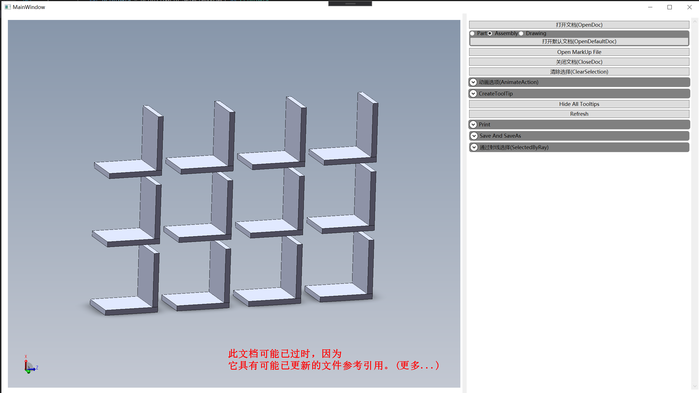
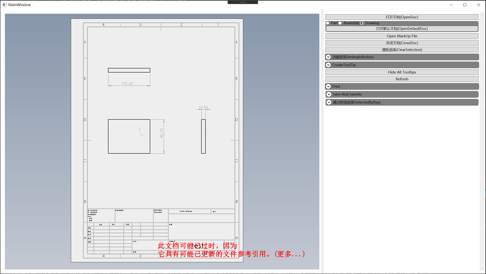
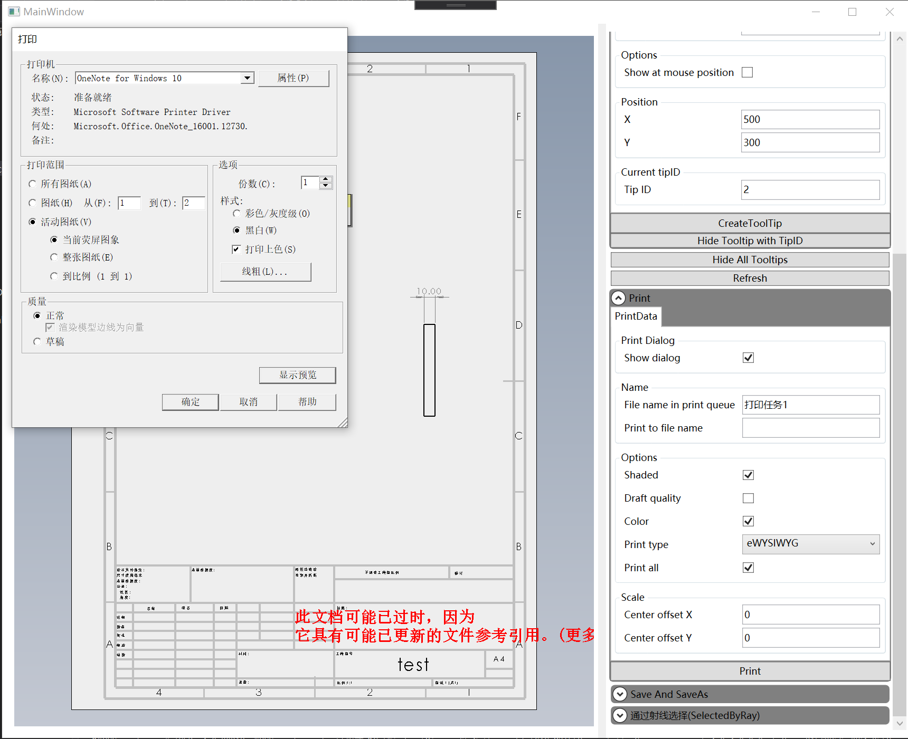
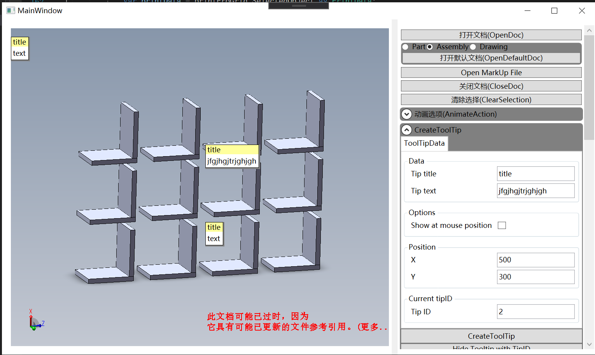
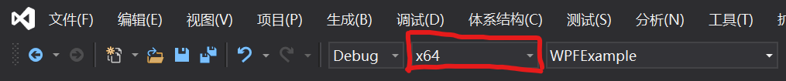
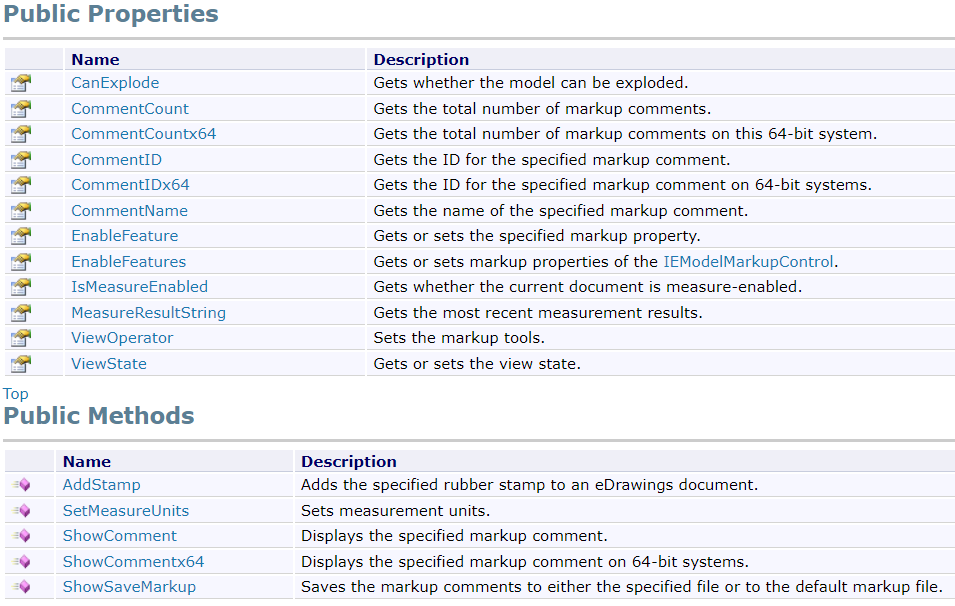

<div align=center></div>


# DuEDrawingControl

[English]((https://github.com/weianweigan/DuEDrawingControl/blob/master/README.md)) | 中文

在Winform和wpf中使用的edrawing 控件。使用了c# dynamic 类型封装，这样就不需要引用edrawing的dll，不需要额外配置，直接引用便可以使用。

**Winform:**

<div align=left></div>

增加测量按钮（2023.3.29）
<div align=left></div>


**WPF**

<div align=left></div>

**PreView Assembly Document**

<div align=left></div>

**PreView Drawing Document**

<div align=left></div>

**Print Document**

<div align=left></div>

**Create ToolTip**

<div align=left></div>

## 安装


```
Install-Package DuEDrawingControl -Version 1.0.1
```


## 使用

**1.需要安装eDrawing**

**2.引用命名空间**
```csharp
using DuEDrawingControl;
```

**3.将平台修改为x64**

<div align=left></div>

**4.添加控件**

### Winform

```csharp

        private EDrawingView eDrawingView;

        private void Form1_Load(object sender, EventArgs e)
        {
            //add edrawing control when form loaded
            eDrawingView = new EDrawingView()
            {
                Dock = DockStyle.Fill
            };
            paneleDrawing.Controls.Add(eDrawingView);
        }

```

Clone this repository for more

### WPF

```csharp
        private DuEDrawingControl.EDrawingWPFControl edrawing;

        public MainWindow()
        {
            InitializeComponent();

            //Add edrawing control
            edrawing = new DuEDrawingControl.EDrawingWPFControl() { 
                Margin = new Thickness(5)
            };
            edrawingPanel.Children.Add(edrawing);
        }
```

Clone this repository for more

## 示例


## 实现的edrawing api




## Contact me

1831197727@qq.com