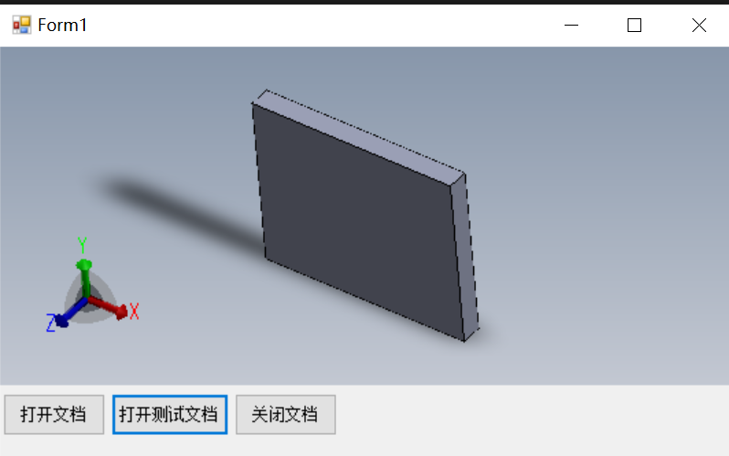
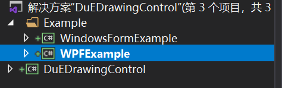
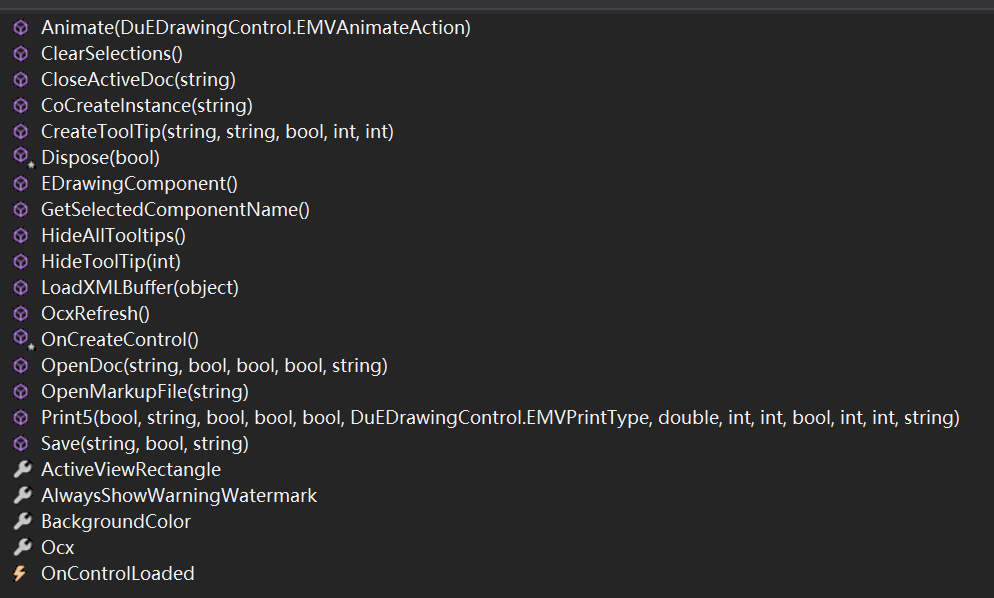

<div align=center></div>


# DuEDrawingControl


English | [Chinese](https://github.com/weianweigan/DuEDrawingControl/blob/master/README.cn.md)


eDrawing Controls for Winform and WPF

**Winform:**

<div align=left></div>

**WPF**

<div align=left></div>

## Install

```
Install-Package DuEDrawingControl -Version 1.0.1
```

## Usage

```csharp
using DuEDrawingControl;
```

### 1.Winform


```csharp

        private EDrawingView eDrawingView;

        private void Form1_Load(object sender, EventArgs e)
        {
            //add edrawing control when form loaded
            eDrawingView = new EDrawingView()
            {
                Dock = DockStyle.Fill
            };
            paneleDrawing.Controls.Add(eDrawingView);
        }

```

Clone this repository for more

### 2.WPF

```csharp
        private DuEDrawingControl.EDrawingWPFControl edrawing;

        public MainWindow()
        {
            InitializeComponent();

            //Add edrawing control
            edrawing = new DuEDrawingControl.EDrawingWPFControl() { 
                Margin = new Thickness(5)
            };
            edrawingPanel.Children.Add(edrawing);
        }
```

Clone this repository for more

## Example



## Api List



## Contact me

1831197727@qq.com